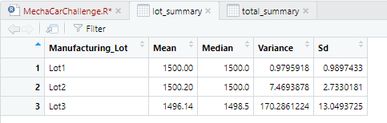

# MechaCar_Statistical_Analysis

## Linear Regression to Predict MPG

Both vehicle length and ground clearance have statistically significant correlation on the MPG. The slope of the linear model is not zero due to this. This linear model does help predict a trend, but the regression does not fit effectively enough to predict a value for MPG.

## Summary Statistics on Suspension Coils

### Total Summary

The above table shows the summary statistics for the suspension coils. The variance is low enough for the total manufacturing data to meet the design specs.

### lot Summary

Manufacturing of lots 1 and 2 meet the design specifications but lot 3 shows too high of a variance, above 100 lb/in^2 variance within the lot.

## T-Test on Suspension coils
The following image shows the t tests for each lot and for all lots total at the end. Lots 1 and 2 showed a p value below 0.05 and therefore could accept the null hypothesis and showed that the means are different, but the p value was too high for lot 3 and the total data.

## Study Design" MechaCar vs Competition
